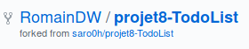
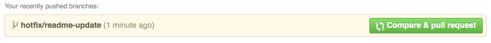

# How to contribute ?
This is a guide to contributing to the project

## Step 1: Set up a working copy on your computer
Firstly you need a local fork of the the project, so go ahead and press the **"fork"** button in GitHub. This will create a 
copy of the repository in your own GitHub account and you’ll see a note that it’s been forked underneath the project name :



Now you need a copy locally, so find the clone url in the right hand column and use that to clone locally using a terminal:  
```shell
git clone https://github.com/{your_github_username}/TodoList.git
```
Then go to the new project's directory:
```shell
cd TodoList
```
Finally, in this stage, you need to set up a new remote that points to the original project so that you can grab any 
changes and bring them into your local copy. Firstly clock on the link to the original repository – it’s labeled "Forked 
from" at the top of the GitHub page. This takes you back to the projects main GitHub page, so you can find the "clone URL" 
and use it to create the new remote, which we’ll call **upstream**.
```shell
git remote add upstream https://github.com/RomainDW/TodoList.git
```
You now have two remotes for this project on disk:
1.   origin which points to your GitHub fork of the project. You can read and write to this remote.
2.   upstream which points to the main project’s GitHub repository. You can only read from this remote.

## Step 2: Get it working on your machine
Now that you have the source code, get it working on your computer by following the [installation instructions](../README.md).

If you get it working, but the documentation is unclear, then improving that bit should be your first PR to the project.

## Step 3: Do some work
This is the fun bit where you get to contribute to the project. It’s usually best to start by fixing a bug that is either 
annoying you or you’ve found on the project’s issue tracker.

Now that you have picks an issue, reproduce it on your version. Once you have reproduced it, read the code to work out 
where the problem is. Once you’ve found the code problem, you can move on to fixing it.

### Branch!
**The number one rule is to put each piece of work on its own branch.**

For this example, we’ll assume we’re fixing a bug, so we branch from master:
```shell
git checkout master
git pull upstream master && git push origin master
git checkout -b hotfix/readme-update
```
Firstly we ensure we’re on the `master` branch. Then the `git pull` command will sync our local copy with the upstream 
project and the `git push` syncs it to our forked GitHub project. Finally we create our new branch. You can name your 
branch whatever you like, but it helps for it to be meaningful. Including the issue number is usually helpful.

Now you can do the work to fix the issue.

The project has tests, so run them to ensure you haven’t broken anything. You may also add a new test to show that your 
change fixes the original problem.

**Ensure that you only fix the thing you’re working on. Do not be tempted to fix some other things that you see along the 
way, including formatting issues, as your PR will probably be rejected.**

## Step 4: Create the PR
To create a PR you need to push your branch to the origin remote and then press some buttons on GitHub.

To push a new branch:
```shell
git push -u origin hotfix/readme-update
```
This will create the branch on your GitHub project. The -u flag links this branch with the remote one, so that in the 
future, you can simply type `git push origin`.

Swap back to the browser and navigate to your fork of the project and you’ll see that your new branch is listed at the 
top with a handy **"Compare & pull request"** button:



Go ahead and press the button!

On the pull request page, ensure that the **"base fork"** points to the correct repository and branch. Then ensure that you provide a good, 
succinct title for your pull request and explain why you have created it in the description box. Add any relevant issue numbers if you have them.

Then,  press the **"Create pull request"** button and you're done.

## Step 5: Review by the maintainers
For your work to be integrated into the project, the maintainers will review your work and either request changes or merge it.

## To sum up
The fundamentals are :
1.   Fork the project & clone locally.
2.   Create an upstream remote and sync your local copy before you branch.
3.   Branch for each separate piece of work.
4.   Do the work, write good commit messages, and read the CONTRIBUTING file if there is one.
5.   Push to your origin repository.
6.   Create a new PR in GitHub.
7.   Respond to any code review feedback.
